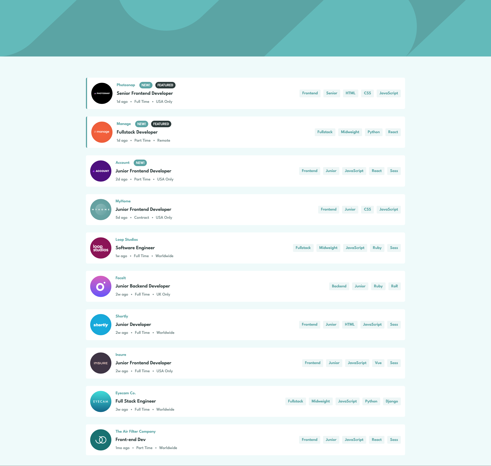

# Frontend Mentor - Job listings with filtering solution

This is a solution to the [Job listings with filtering challenge on Frontend Mentor](https://www.frontendmentor.io/challenges/job-listings-with-filtering-ivstIPCt). Frontend Mentor challenges help you improve your coding skills by building realistic projects. 

## Table of contents

- [Overview](#overview)
  - [The challenge](#the-challenge)
  - [Screenshot](#screenshot)
  - [Links](#links)
- [My process](#my-process)
  - [Built with](#built-with)
  - [What I learned](#what-i-learned)
- [Author](#author)


## Overview

### The challenge

Users should be able to:

- View the optimal layout for the site depending on their device's screen size
- See hover states for all interactive elements on the page
- Filter job listings based on the categories

### Screenshot




### Links

- Solution URL: [https://github.com/yalit/fem-joblistings](https://github.com/yalit/fem-joblistings)
- Live Site URL: [https://yalit.github.io/fem-joblistings/](https://yalit.github.io/fem-joblistings/)

## My process

### Built with

- Semantic HTML5 markup
- CSS custom properties
- Flexbox
- Mobile-first workflow
- [React](https://reactjs.org/) - JS library
- [Next.js](https://nextjs.org/) - React framework
- [Styled Components](https://styled-components.com/) - For styles

### What I learned

Some of the elements I learned:
- Use of Next.js as backend
- Use of Typescript & React Context together

```ts
const [state, dispatch] = useReducer<Reducer<FilterState, FilterAction>>(filterReducer,initialFilters);
```

## Author

- Website - [Yannick Alsberge](https://www.github.com/yalit)
- Frontend Mentor - [@yalit](https://www.frontendmentor.io/profile/yalit)

